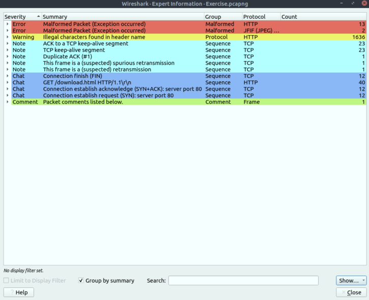
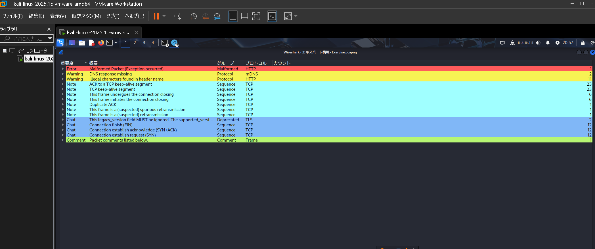

# Wireshark Expert Info 表示件数のバージョン依存性
## 概要

TryHackMeルーム「Wireshark: The Basics」に付属の.pcapngファイルを用い、WiresharkのバージョンによってExpert Infoに表示される件数が大きく異なる現象を観察した。

##  検証環境

| 環境 | バージョン | 備考 |
|------|------------|------|
| TryHackMe（演習マシン） | Wireshark v3.2.3 | 答えの参照元 |
| 自前環境（Kali Linux） | Wireshark v4.4.6 | 最新安定版（2025年時点） |

##  検証対象の.pcapファイル

- ファイル名：`Exercise.pcapng`（TryHackMe提供）
- 内容：Wireshark: The Basicsの回答に必要な情報あり。

##  比較結果

| 警告内容 | v3.2.3 件数 | v4.4.6 件数 |
|----------|-------------|-------------|
| Illegal characters in header name | 1636 | 11 |

###  v3.2.3（TryHackMe環境）

###  v4.4.6（Kali環境）

→ 同一のファイルに対して、表示される警告件数が異なる

##  考察

- v3.2.3とv4.4.6では、Warningカウントルールに差異があると考えられる。バージョン間での挙動の違いは、パケット解析・検知に影響を与える可能性があり、検証環境の統一が重要となる。SOCやCTFなどで「件数が合わない」「再現できない」場合、ツール差異が原因の可能性がある。よって **ログ解析・再現性検証において、ツールバージョンは必ず明記する** ことが重要であると結論付けられる。

##  補足

- `Exercise.pcapng` はTryHackMeの演習マシンから取得（配布不可）
- 本記録は学習・再現性検証目的であり、攻撃PoCではありません
